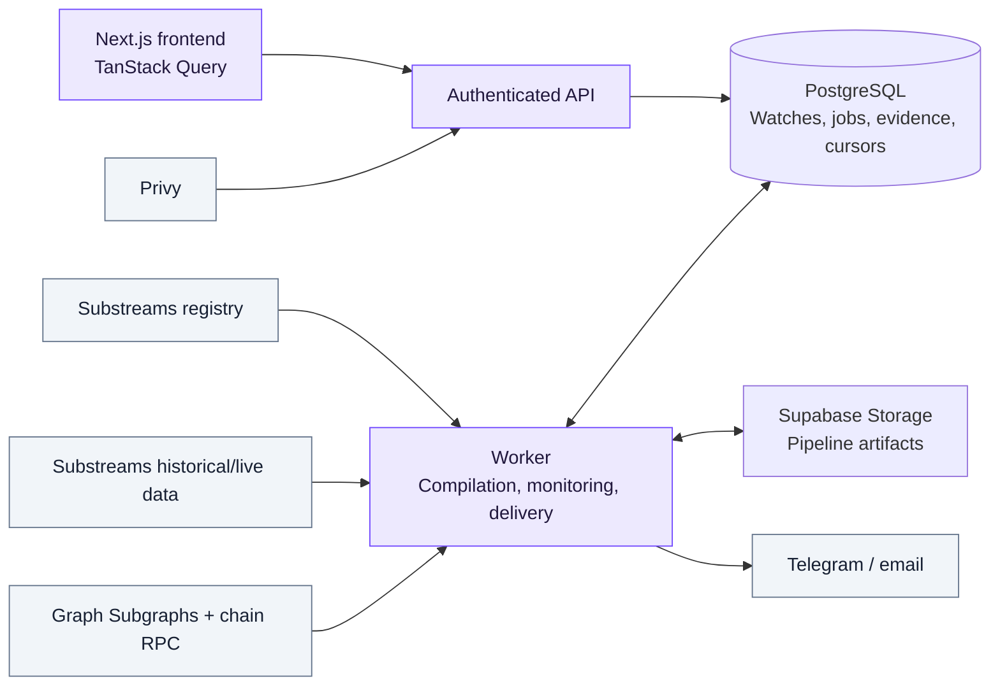
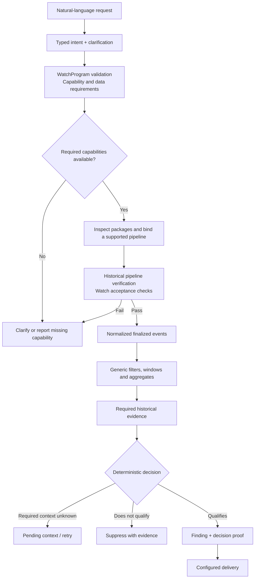

<h1 align="center">Scout</h1>

<p align="center">Turn onchain monitoring intent into verified infrastructure.</p>

Scout lets you describe an onchain signal in plain language. It resolves the request, asks for missing details, inspects Substreams packages, and verifies supported data pipelines against chain history before monitoring finalized events.

The aim is to make monitoring useful without requiring users to know contract addresses, event ABIs, indexing infrastructure, or query languages. AI interprets the request; deterministic code evaluates rules, historical evidence, and delivery decisions.

**Current scope:** Ethereum Uniswap V3 WETH/USDC swaps and canonical USDC transfers on Base. Scout can understand more requests than it can deploy. Missing capabilities stop activation with an explanation. It does not trade autonomously.

[Capabilities](#supported-capabilities) · [Architecture](#architecture) · [Local setup](#local-development) · [Tests](#validation)

## History provenance

The commits on this branch are an **editorial reconstruction of the September 13, 2026 source snapshot**. Their author dates were assigned across September 7–13 for review organization; they are **not evidence that the committed code existed on those dates**. Committer dates record when these commits were actually created. Commit messages repeat this disclosure. The 56 component groups assign eight commits to each day. They assemble one current source tree; intermediate commits are not recovered releases and may not build independently.

The inspected checkout had no commits, refs, reflog, stashes, tags, remote, or recoverable Git objects. Partial editor snapshots from September 7 and 12, and local build/provider records, do not establish complete historical repository states. No historical engineering milestone was reconstructed from those fragments. The `backup/pre-reconstruction-20260913` branch preserves the public source before this organization. Recorded integration evidence retains its own dates and limitations independently of Git author dates.

## Supported capabilities

| Request or capability                                                                                   | Status                                                                                                                 |
| ------------------------------------------------------------------------------------------------------- | ---------------------------------------------------------------------------------------------------------------------- |
| Uniswap V3 WETH/USDC swaps on Ethereum                                                                  | Executable for the installed 0.05% and 0.30% pools, with explicit scope                                                |
| Large canonical USDC transfers on Base                                                                  | Executable using a nominal USDC amount threshold                                                                       |
| Prior Uniswap V3 activity by actor                                                                      | Typed Graph evidence; absence requires proven coverage                                                                 |
| Grouping, rolling windows, counts, sums, averages, extrema, median, distinct values and observed deltas | Available as runtime primitives; arbitrary compositions are not all deployable through public Watch creation           |
| Ethereum Uniswap V4 signed liquidity changes                                                            | Adapter, historical verification and generic findings implemented; healthy LIVE verification pending provider capacity |
| Liquidity USD thresholds, V3 Mint/Burn, LP ownership and pool creation                                  | Unsupported                                                                                                            |
| Arbitrary generated Rust, mempool prediction and wallet ownership inference                             | Unsupported                                                                                                            |

Example requests:

> Watch USDC transfers above $500K on Base.

> Watch Uniswap V3 ETH/USDC buys above $100K from wallets that haven't traded on Uniswap before.

Scout asks for details that materially affect execution, including pool scope. The installed pools do not represent every WETH/USDC fee tier. “No prior Uniswap activity” is bounded to verified V3 coverage; it does not establish wallet age or prior V2/V4 use.

“Watch liquidity removals from Uniswap V4 on Ethereum” compiles signed liquidity decreases through the generic runtime. A request such as “Flag liquidity removals above $500K” remains unsupported: liquidity units are not token amounts or USD. **Finding a package is not proof that its events, valuation, or executable integration satisfy a request.**

## Architecture

Protocols supply data semantics. Scout supplies monitoring semantics.



The browser submits requests and reads backend-owned progress. The worker owns compilation, builds, provider sessions, investigation, and delivery. PostgreSQL persists workflow events, immutable programs and findings, evidence, leases, and restart checkpoints.

### From intent to a finding

A **WatchProgram** is the typed monitoring program evaluated against normalized events. Supported acquisition paths must pass program validation, pipeline verification, and Watch acceptance checks before live monitoring is allowed.



The compiler migration is still incremental: existing executable contracts feed WatchProgram compilation, and Uniswap incident delivery coexists with generic findings. General composition deployment, generic investigation scheduling, and shared-stream supervision remain unfinished.

## The Graph and Uniswap integration

**Substreams acquires chain data.** Scout searches the real registry and inspects package/module descriptors. Base parameterizes `ethereum-common@v0.3.3`; Uniswap composes the pinned foundation with Scout's trusted V3 Rust decoder. Arbitrary generated code is disabled.

**Graph Subgraphs provide historical context.** The V3 adapter preserves transaction initiators, asset movements, block-bound valuation, and provenance. Typed historical results distinguish `FOUND`, `NONE_WITH_PROVEN_COVERAGE`, `UNKNOWN`, and retryable errors. An empty query alone never proves absence; unknown required history keeps a finding pending.

**Verification has separate layers.** Pipeline checks compare real historical output with independent references. Watch acceptance checks cover matching semantics. A passing replay does not prove a currently healthy live stream or successful external delivery. Live health depends on observed heartbeat and block progress, and finalized monitoring includes finality latency.

Reusable integration entry points are available in the packages and apps directories.

[FEEDBACK.md](FEEDBACK.md) contains developer integration feedback.

## Local development

**Prerequisites:** Node **24.20.0**, pnpm **11.25.0**, and Docker for local Supabase. Local pipeline builds additionally need Rust 1.98.1, the WASM target, `protoc`, and the Substreams CLI. The worker Docker image bundles build dependencies.

From the repository root:

```sh
pnpm install --frozen-lockfile
pnpm db:start
pnpm db:migrate
pnpm setup:local
```

`setup:local` writes ignored web/worker environment files with local Supabase settings and preserves existing provider settings. It does not provision authentication or provider credentials.

Configure Privy authentication and the required providers below. Start the web app and worker in separate terminals:

```sh
pnpm dev       # web app at http://localhost:3000
pnpm worker    # durable workflow and monitoring worker
```

Open `/watches`, sign in, describe a signal, and answer any necessary clarification. Workflow progress and verification evidence remain available after a browser refresh. Configure optional alert destinations in Connections.

Accounts allow five non-archived Watches, including failed requests. **Delete watch** removes a Watch from the active list and frees a slot; its history remains in Archived and can be restored.

### Configuration

Use [apps/web/.env.example](apps/web/.env.example) and [apps/worker/.env.example](apps/worker/.env.example) as the authoritative templates.

| Purpose                          | Main variables                                                                                                                                    |
| -------------------------------- | ------------------------------------------------------------------------------------------------------------------------------------------------- |
| Authentication                   | `NEXT_PUBLIC_PRIVY_APP_ID`, server-only `PRIVY_APP_SECRET`                                                                                        |
| Database and storage             | Web `NEXT_PUBLIC_SUPABASE_URL`; worker `DATABASE_URL`, `SUPABASE_URL`; server-only `SUPABASE_SERVICE_ROLE_KEY`                                    |
| Application URL                  | `SCOUT_SITE_URL`                                                                                                                                  |
| Intent resolution                | `GROQ_API_KEY`, `GROQ_MODEL`                                                                                                                      |
| Ethereum and historical context  | `ETHEREUM_RPC_URL`, `GRAPH_API_KEY`, `GRAPH_SUBGRAPH_ID`                                                                                          |
| Substreams                       | `SUBSTREAMS_API_KEY` or `SUBSTREAMS_API_TOKEN`, `SUBSTREAMS_ENDPOINT`, `SUBSTREAMS_BIN`, `SUBSTREAMS_TEMPLATE_DIR`, `SUBSTREAMS_SESSION_CAPACITY` |
| Base monitoring                  | `BASE_RPC_URL`, `BASE_SUBSTREAMS_ENDPOINT`                                                                                                        |
| Optional Telegram alerts         | `TELEGRAM_BOT_TOKEN`, web bot username and webhook secret                                                                                         |
| Optional email alerts            | `RESEND_API_KEY`, `RESEND_FROM_EMAIL`, web webhook secret, shared `EMAIL_LINK_SECRET`                                                             |
| Optional user-reviewed swap flow | `UNISWAP_API_KEY`                                                                                                                                 |

Graph query credentials and Substreams data-plane credentials are distinct. Match session capacity to your provider account: one slot is reserved for verification, so capacity two allows one live stream. Never expose service credentials through `NEXT_PUBLIC_*` variables.

See deployment documentation for service configuration and delivery requirements.

## Validation

```sh
pnpm check                 # formatting, lint, types, TypeScript tests
pnpm pipeline:test         # Rust decoder tests
pnpm pipeline:lint         # Rust Clippy
pnpm format:check:rust      # Rust formatting
pnpm test:db               # local database workflows
pnpm test:db:correctness   # rollback-only correctness and recovery checks
pnpm test:e2e              # browser journeys; requires Playwright Chromium
pnpm build                 # production web and worker checks
```

Install the browser if needed with `pnpm exec playwright install chromium`. To use an existing app server and installed Chrome:

```sh
SCOUT_E2E_URL=http://localhost:3000 SCOUT_E2E_CHANNEL=chrome pnpm test:e2e
```

Real-provider checks require credentials and previously verified local artifacts.

After schema changes, add a migration and run `pnpm db:types`. Do not rewrite applied migrations. Test fixtures and replay results must remain distinguishable from live execution and external delivery.

## Contributing and license

Include a reproducible case and run the checks relevant to your change. Preserve historical uncertainty, immutable evidence, ownership isolation, worker leases, and replay idempotency. Keep credentials and local artifacts out of commits.

Licensed under [MIT](LICENSE).
